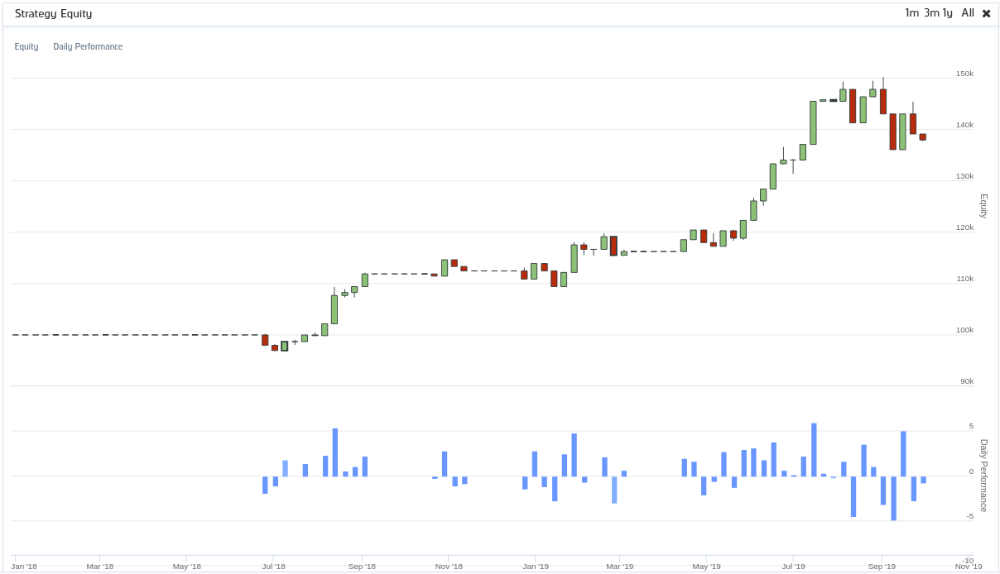

# gold_pair_trade_research
*NOTE: FOR EDUCATIONAL PURPOSES ONLY*
A linear mean reverting pairs-trading strategy.
We use tickers GLD and GDX. GLD versus GDX is a good candidate for pair trading because GLD reflects the spot price of gold, and GDX is a basket of gold-mining stocks. It makes intuitive sense that their prices should move in tandem.

The backtest was done on QuantConnect yielding a 37.95% return.

Dedicated backetst url:
https://www.quantconnect.com/terminal/processCache/?request=embedded_backtest_b284ee60e10c6a4983df7774097076fe.html

